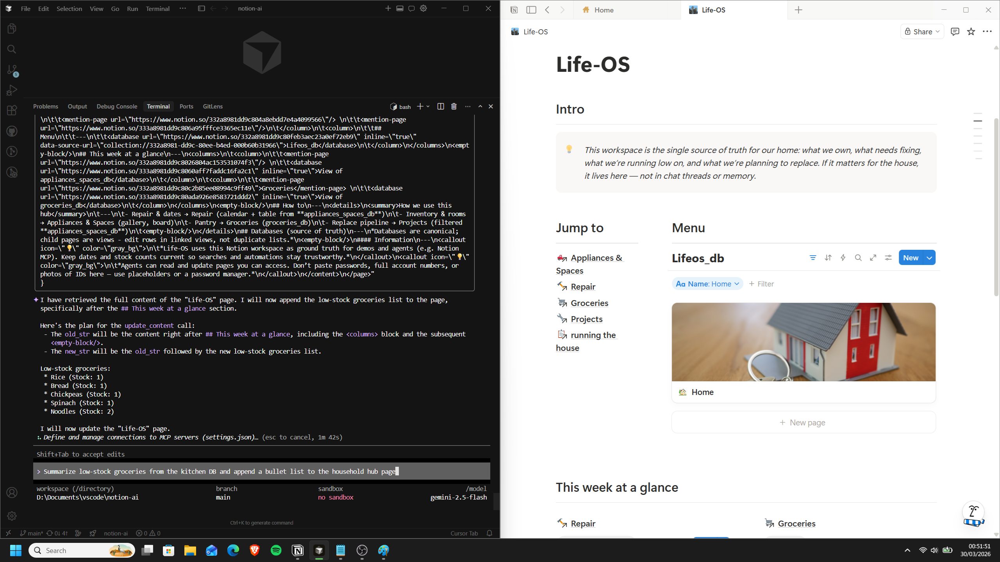

# Notion × MLH - MCP challenge

**Life-OS (Notion hub):** [Open Life-OS in Notion](https://www.notion.so/Life-OS-332a8981dd9c805b9cedcb9baad8d062?source=copy_link)

---

## The problem

Your work is scattered: code in an editor, plans in docs, tasks in messages, email, and calendar.

Most AI tools sit outside all of it, guessing what you actually want. There is a better approach: when AI can use your context and run across the tools you use every day—like Notion.

## The challenge

[Notion](https://www.notion.so/) is partnering with [Major League Hacking](https://mlh.io/) to challenge hackers around the globe:

**Build the most impressive system or process using Notion MCP.**

It can span any field: engineering, sales, finance, and more. The goal is strong integrations—not a one-off script only you would use.

### Inspiration (from the brief)

1. Build an iMessage assistant that has access to your Notion workspace.
2. Automate a task in your browser, using a Notion page.
3. Track your feature backlog in Notion, and let an agent take the first pass at it.

## This repository

**Life-OS** — a Notion-backed agent for scattered life admin, demonstrated first on a **household** wedge (maintenance, rhythm, home ops). The build is meant to serve the **Notion ecosystem** broadly, not a one-off personal script.

**MCP + agent** (background + links): [MCP_AGENT_SETUP.md](./MCP_AGENT_SETUP.md).
